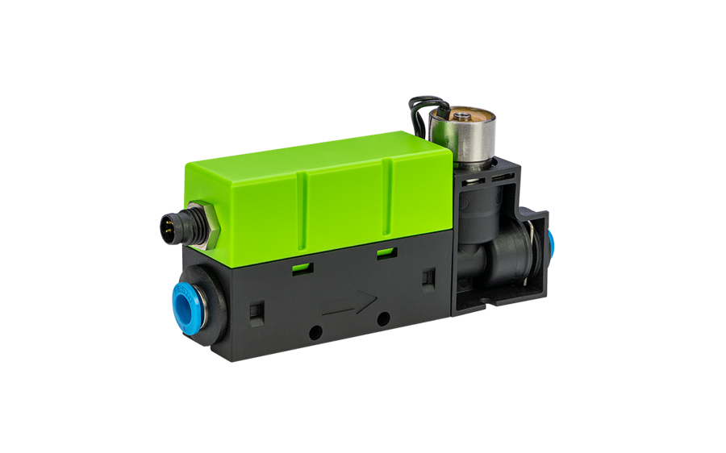
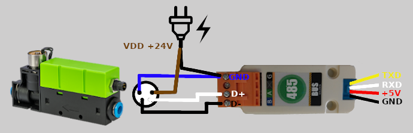
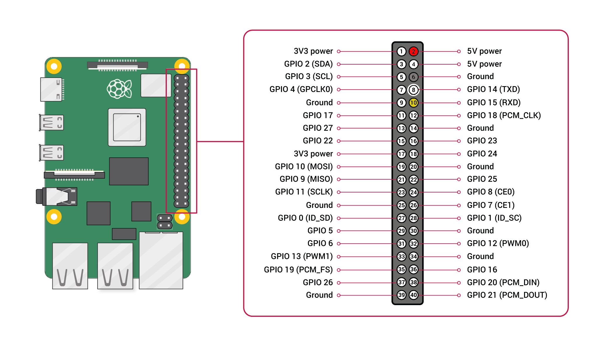
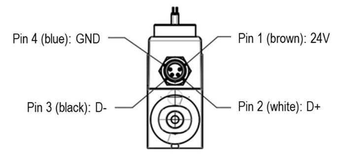

# Sensirion Raspberry Pi UART SFC6XXX Driver

The repository provides a driver for setting up a SFC6XXX sensor to run on a Raspberry Pi over UART using the SHDLC protocol. 

<center></center>

Click [here](https://sensirion.com/sfc6000) to learn more about the Sensirion SFC6XXX sensor family.

## Supported sensor types

- [SFC6000](https://sensirion.com/products/catalog/SFC6000/)
- [SFC6000D-5SLM](https://sensirion.com/products/catalog/SFC6000D-5slm/)
- [SFC6000D-50SLM](https://sensirion.com/products/catalog/SFC6000D-50slm/)
- [SFC6000D-20SLM](https://sensirion.com/products/catalog/SFC6000D-20slm/)

The following instructions and examples use a *SFC6000*.


## Connect the sensor

Please note that the sensor needs to be connected to a 24V power supply.

<details><summary>Connecting the Sensor over USB</summary>
<p>
Plug in the provided cable to power and connect the USB port to your Raspberry Pi.

Please note that due to the delays introduced by the FTDI driver you can 
reach a maximum sampling frequency of about 20Hz with this setup.
</p>
</details>


<details><summary>Connecting the Sensor over RS485 converter</summary>
<p>

With this connection setup you can reach a sampling frequency of 100Hz or more.


To connect the sensor to your Raspberry Pi serial interface you need a RS485 to RS232 converter. For example, you can use following material:

- [RS485 to RS232 Converter U094 from M5Stack](https://www.distrelec.ch/en/isolated-rs485-transceiver-unit-m5stack-u094/p/30185750)
- [M8 socket to Bare End Cable](https://www.distrelec.ch/en/actuator-sensor-cable-m8-socket-bare-end-conductors-5m-phoenix-contact-1681842/p/11033799) to connect the sensor to the converter
- [Grove to pin header cable](https://www.distrelec.ch/en/grove-pin-female-jumper-to-grove-pin-conversion-cable-seeed-studio-110990028/p/30069938) to connect the RS485 converter to your Raspberry Pi board

Wire the sensor to the RS485 converter using the M8 socket to Bare End Cable:

| *Sensor Pin* | *Cable Color* | *Name* | *Converter connection*  | *Comments* |
|--------------|---------------|:-------------:|------------|------------|
| 1 | brown | VDD | - | Connect to external power supply (+24V).
| 2 | white | D+ | A | 
| 3 | black | D- | B | 
| 4 | blue | GND | Ground | Connect the Ground of the external power supply to the adapter ground as well




Wire the RS485 converter to your Raspberry Pi using the Grove to pin header cable:

| *Converter* | *Cable Color* | *Raspberry Pi Pin* | *Comments* |
|--------------|---------------|:-------------:|------------|
| TXD | yellow | Pin 10 (RXD) | UART communication, cross over |
| RXD | white | Pin 8 (TXD) | UART communication, cross over | 
| 5V | red | Pin 2 (VDD) | Power supply for the RS485 converter |
| GND | black | Pin 6 (GND) |  |



> **Note:** Make sure to [configure your hardware serial interface](https://www.raspberrypi.com/documentation/computers/configuration.html#disabling-the-linux-serial-console) on your Raspberry Pi.

> **Note:** Make sure to connect serial pins as cross-over (RXD of converter -> TXD on Raspberry Pi; TXD of converter -> RXD pin of Raspberry Pi)

</p>
</details>

<details>
<summary>
Custom setup - sensor pinout
</summary>
<p>
The M8 connector of your SFC6XXX has the following pinout:



| *Pin* | *Cable Color* | *Name* | *Description*  | *Comments* |
|-------|---------------|:------:|----------------|------------|
| 1 | brown | VDD | Supply Voltage | +24V
| 2 | white | D+ |  | 
| 3 | black | D- |  | 
| 4 | blue | GND | Ground | 

</p>
</details>
</br>


## Quick start example

- [Install the Raspberry Pi OS on to your Raspberry Pi](https://projects.raspberrypi.org/en/projects/raspberry-pi-setting-up)
- Download the SFC6XXX driver from [Github](https://github.com/Sensirion/raspberry-pi-uart-sfc6xxx) and extract the `.zip`
  on your Raspberry Pi
- Connect the SFC6XXX sensor as explained in the [section above](#connect-the-sensor)
- Check that the correct serial port is set in the define in `sensirion_uart_portdescriptor.h`
   - For connection over USB (in case you have other devices connected check the USB number)

     `#define SERIAL_0 "/dev/ttyUSB0"`

   - For connection over UART Pins using the RS485 Converter

     `#define SERIAL_0 "/dev/serial0"`

- Compile the driver
    1. Open a [terminal](https://projects.raspberrypi.org/en/projects/raspberry-pi-using/8)
    2. Navigate to the driver directory. E.g. `cd ~/raspberry-pi-uart-sfc6xxx`
    3. Navigate to the subdirectory example-usage.
    4. Run the `make` command to compile the driver

       Output:
       ```
       rm -f sfc6xxx_uart_example_usage
       cc -Os -Wall -fstrict-aliasing -Wstrict-aliasing=1 -Wsign-conversion -fPIC -I. -o sfc6xxx_uart_example_usage sfc6xxx_uart.h sfc6xxx_uart.c sensirion_uart_hal.h sensirion_shdlc.h sensirion_shdlc.c \ 
           sensirion_uart_hal.c sensirion_config.h sensirion_common.h sensirion_common.c sfc6xxx_uart_example_usage.c
       ```
- Test your connected sensor
    - Run `./sfc6xxx_uart_example_usage` in the same directory you used to compile the driver. You should see the
      measurement values in the console.

## Troubleshooting

### Building driver failed

If the execution of `make` in the compilation step 3 fails with something like

```bash
 make: command not found
```

your RaspberryPi likely does not have the build tools installed. Proceed as follows:

```
$ sudo apt-get update
$ sudo apt-get upgrade
$ sudo apt-get install build-essential
```


## Contributing

**Contributions are welcome!**

We develop and test this driver using our company internal tools (version
control, continuous integration, code review etc.) and automatically
synchronize the master branch with GitHub. But this doesn't mean that we don't
respond to issues or don't accept pull requests on GitHub. In fact, you're very
welcome to open issues or create pull requests :)

This Sensirion library uses
[`clang-format`](https://releases.llvm.org/download.html) to standardize the
formatting of all our `.c` and `.h` files. Make sure your contributions are
formatted accordingly:

The `-i` flag will apply the format changes to the files listed.

```bash
clang-format -i *.c *.h
```

Note that differences from this formatting will result in a failed build until
they are fixed.


## License

See [LICENSE](LICENSE).